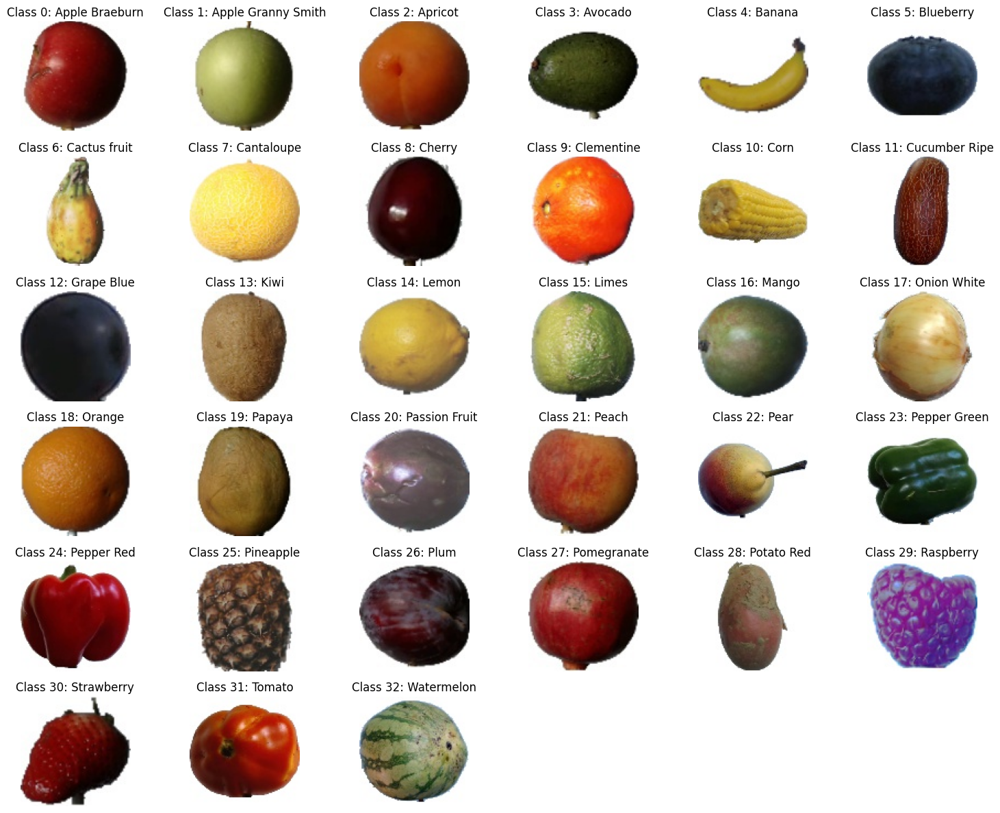
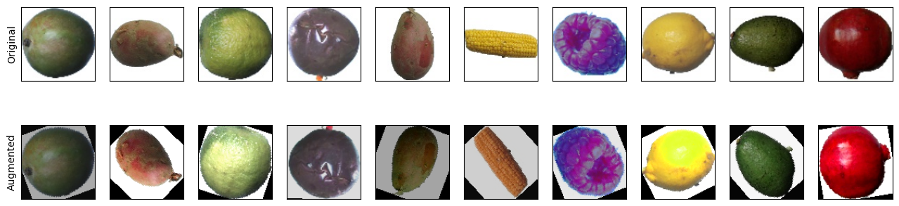

# Fruit Classification Using Convolutional Neural Networks

## Table of Contents
1. [Introduction](#introduction)
2. [Problem Statement](#problem-statement)
3. [Solution](#solution)
4. [Discussion and Limitation](#discussion-and-limitation)
5. [Conclusion](#conclusion)
6. [Instructions to Execute the Code](#instructions-to-execute-the-code)
7. [References](#references)

## Introduction
In the agriculture and food industry, accurate classification of fruits is key to efficient processing, handling, and distribution. Traditional methods reliant on human inspection are labor-intensive and error-prone. This project leverages Convolutional Neural Networks (CNNs) for automated fruit classification, aiming to revolutionize the precision and speed of the process. The application of CNNs addresses the need for standardized quality assessment, offering rapid sorting and defect identification.

## Problem Statement
The dataset consists of 16854 images categorized into separate folders for each class, with an additional 5641 unlabeled images. The data was sourced from Kaggle. Each image is in .jpg format with 100 x 100 pixels and was split into 70% for training and 30% for testing. The goal is to train a CNN model to classify these images accurately.

## Solution
The project involves selecting and training a CNN model to classify the images and compare the results with the true labels. The CNN-specific procedure includes Kernel, Padding, Stride, Pooling, and Data Augmentation. Hyperparameter Tuning, Regularization, and Cross-Validation were applied to find the optimal result.

### Data Preparation
Data preprocessing involved using image processing packages to read RGB images, convert them to numerical data, and save them in compact-sized files for efficient data storage and sharing. NPZ format was chosen for its storage efficiency and utilization of the NumPy data type.

### Model Architecture
The final CNN model architecture:
- Input RGB image size (3, 100, 100)
- Conv layer 1: (16 filters, 7 kernel size, 2 strides, 1 padding) + Max pooling layer (2x2) + ReLU activation
- Conv layer 2: (32 filters, 5 kernel size, 1 strides, 1 padding) + Max pooling layer (2x2) + ReLU activation
- Conv layer 3: (64 filters, 5 kernel size, 1 strides, 1 padding) + Max pooling layer (2x2) + ReLU activation
- Flattened output: [1024]
- Final output: [33]

### Hyperparameter Tuning
- Loss Function: Categorical Cross-Entropy
- Optimizer: Adam with a learning rate of 0.001
- Epochs: 10
- Mini-batch size: 128

### Data Augmentation
Data augmentation was applied to increase the dataset size, reduce overfitting, and improve model robustness. Techniques included random horizontal flip, random vertical flip, random rotation, and color jitter.

### Feature Analysis
The analysis focused on three primary features: color, shape, and texture. Each feature's impact on classification accuracy was tested by isolating and manipulating the features in the training images.

## Discussion and Limitation
Hyperparameter tuning was conducted to balance model complexity, convergence speed, and computational efficiency. The analysis revealed that while the shape of fruits enhances distinctiveness, texture and fine details are fundamental for optimal performance.

## Conclusion
This project demonstrates the efficacy of CNNs in fruit classification, achieving high accuracy with a well-tuned model. The final evaluation on the reserved testing dataset achieved a prediction accuracy of 97.35%.

## Instructions to Execute the Code

### Import Image Data (fruit_train.npz file is required to execute the code)

**Method I:**
1. Download the original image data (107 MB) from [Kaggle](https://www.kaggle.com/datasets/sshikamaru/fruit-recognition).
2. Execute the code from `FruitImageCompressor.ipynb` to generate the compressed file `fruit_train.npz` (288 MB). This may take several minutes.

**Method II:**
1. Download `fruit_train.npz` (288 MB) from [MEGA](https://mega.nz/file/QKp3nKwJ#MsqiZBOiBBTfu0AdYZAT1nP7HLa1WwxcbObnM7TrGJI).

`fruit_train.npz` is the key file for us to retrieve image data efficiently.

### Execute the Code
1. Execute the code from `FruitClassification_HyperparameterTuning.ipynb` to see the results of hyperparameter tuning.
2. Execute the code from `FruitClassification_FeatureAnalysis.ipynb` to see the results of data augmentation and feature analysis.

## References
- He, K., Zhang, X., Ren, S., & Sun, J. (2016). Deep residual learning for image recognition. In Proceedings of the IEEE conference on computer vision and pattern recognition (pp. 770-778).
- Krizhevsky, A., Sutskever, I., & Hinton, G. E. (2012). Imagenet classification with deep convolutional neural networks. Advances in neural information processing systems, 25.
- Dosovitskiy, A., Beyer, L., Kolesnikov, A., Weissenborn, D., Zhai, X., Unterthiner, T., ... & Houlsby, N. (2020). An image is worth 16x16 words: Transformers for image recognition at scale. arXiv preprint arXiv:2010.11929.
- CS231N convolutional neural networks for visual recognition. [CS231N](https://cs231n.github.io/convolutional-networks/) (accessed Dec. 16, 2023).
- D. Soni, “Translation invariance in Convolutional Neural Networks”, Medium, [Translation Invariance](https://divsoni2012.medium.com/translation-invariance-in-convolutional-neural-networks-61d9b6fa03df) (accessed Dec. 16, 2023).
- D. Godoy, “Understanding binary cross-entropy / log loss: A visual explanation”, Medium, [Binary Cross-Entropy](https://towardsdatascience.com/understanding-binary-cross-entropy-log-loss-a-visual-explanation-a3ac6025181a) (accessed Dec. 16, 2023).
- J. Brownlee, “How to choose loss functions when Training Deep Learning Neural Networks”, MachineLearningMastery.com, [Choosing Loss Functions](https://machinelearningmastery.com/how-to-choose-loss-functions-when-training-deep-learning-neural-networks/) (accessed Dec. 16, 2023).

## Project Files
- [FruitClassification_HyperparameterTuning.ipynb](https://github.com/aidenliw/Fruit-Classification-CNN/blob/main/FruitClassification_HyperparameterTuning.ipynb)
- [FruitClassification_FeatureAnalysis.ipynb](https://github.com/aidenliw/Fruit-Classification-CNN/blob/main/FruitClassification_FeatureAnalysis.ipynbb)
- [FruitImageCompressor.ipynb]([/FruitImageCompressor.ipynb](https://github.com/aidenliw/Fruit-Classification-CNN/blob/main/FruitImageCompressor.ipynb))
- [fruit_train.npz]([/fruit_train.npz](https://mega.nz/file/QKp3nKwJ#MsqiZBOiBBTfu0AdYZAT1nP7HLa1WwxcbObnM7TrGJI))
